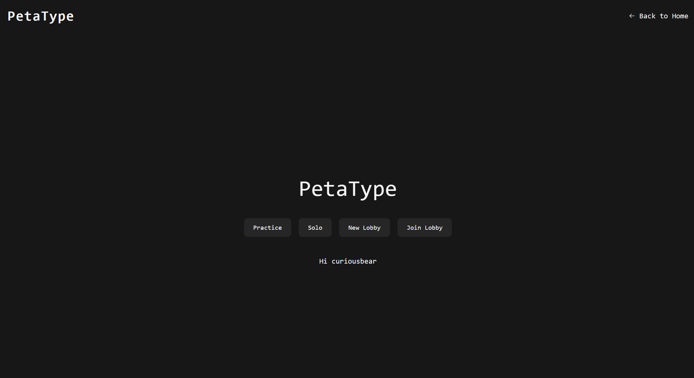
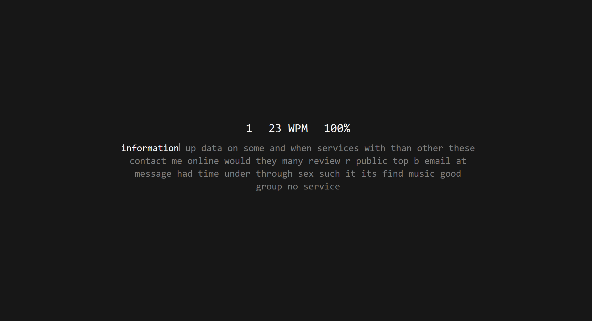
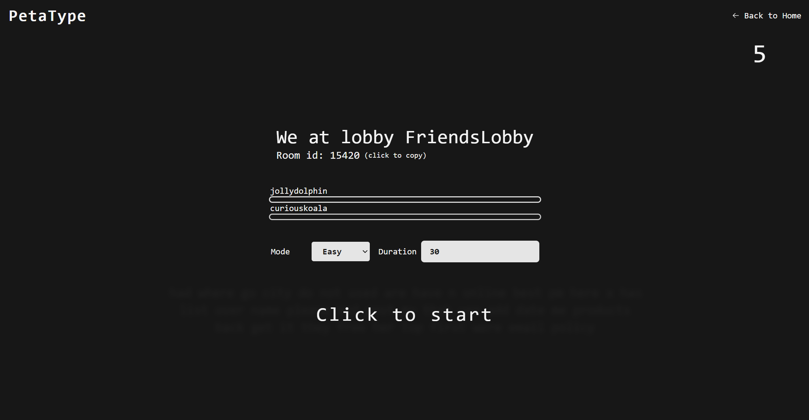
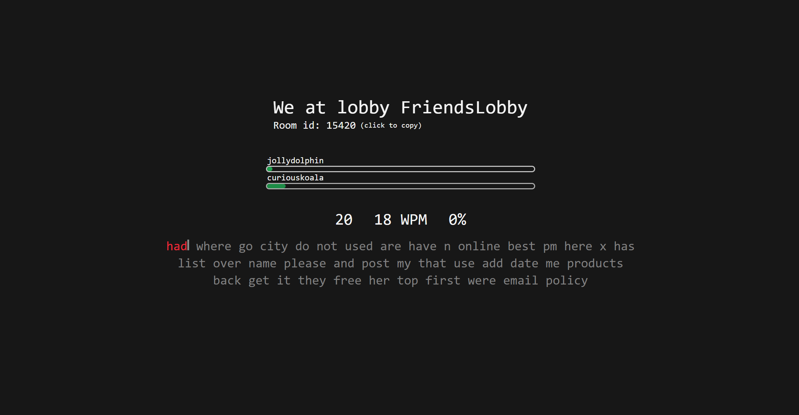

# PetaByte - Speed Typing

PetaByte is a web application that lets users test their typing speed and accuracy in a fun and competitive environment. It offers two exciting modes: Solo Mode for individual practice and Multi Mode for players to compete against each other. The app is built using Next.js, Supabase, Socket.io, and Redis to ensure a seamless and real-time experience for all users.

# Features

- Solo Mode: Practice typing with random texts and get instant feedback on your accuracy and words per minute (WPM).

- Multi Mode: Compete against other players in real-time and view each player's progress during the typing challenge.
- Leaderboard: Keep track of the top performers in the Multi Mode and strive to climb up the ranks.

- Diverse Texts: PetaByte offers a wide range of texts from various genres to keep the typing experience engaging and interesting.
- User Authentication: Users can create accounts and log in to save their progress and compare their statistics with others.

## Technologies Used

- Next.js: A React framework that enables server-side rendering, making the application fast and SEO-friendly.
- Supabase: An open-source Firebase alternative that provides authentication, database, and storage services.
- Socket.io: A library for real-time, bidirectional communication between the server and clients, essential for Multi Mode functionality.
- Redis: An in-memory data structure store used for caching and managing real-time data in Multi Mode.

## Installation and Setup

To run PetaByte on your local machine, follow these steps:

1. Clone the repository from GitHub:
   <code>
   git clone https://github.com/your-username/petabyte.git  
   cd petabyte
   </code>
1. Install dependencies:
   <code>
   npm install
   </code>
1. Configure Supabase:

   1. Create a Supabase project and obtain your API keys.
   1. Set up the necessary tables and columns for user data and typing challenge records.

1. Configure Redis:

   1. Install Redis on your machine.
   1. Update the Redis connection settings in the application.

1. Run the application:
   <code>
   npm run dev
   </code>
1. Open your browser and access the application at http://localhost:3000.

## Known Issues

- Synchronization issues in Multi Mode: Starting the game works fine most of the time. Restarting doesn't work most of the time.
- Text synchronization issues in Multi Mode: The text is not synchronized properly between players.

Enjoy testing your typing skills and having a great time competing with others.

Happy typing! 🚀
